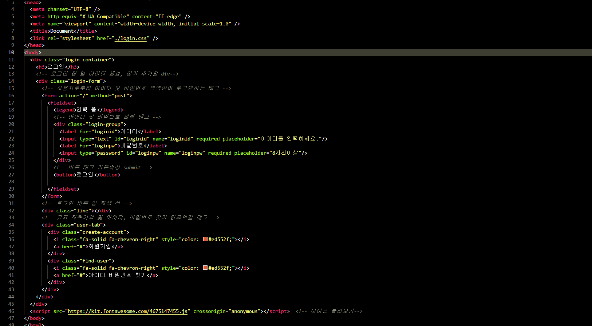
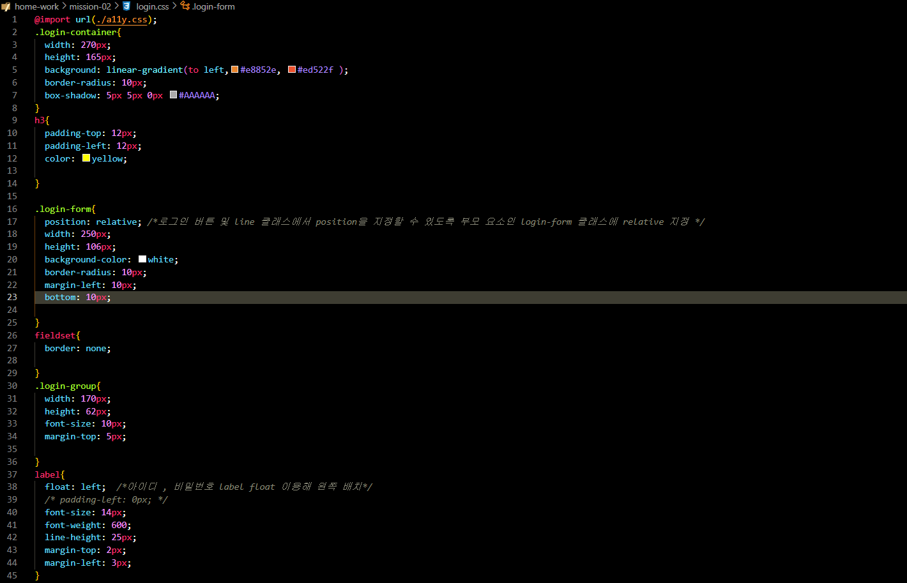
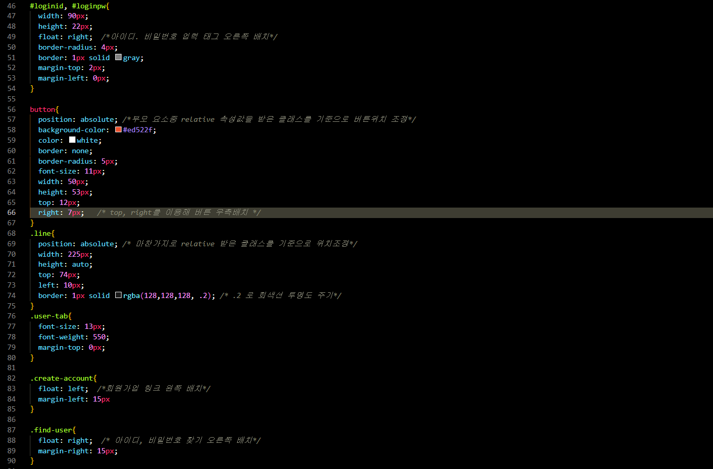
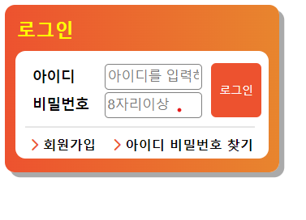

# mission-02 설명
## html 코드

제목 및 폼 태그를 가지는 login-container 마크업. 이후 사용자로부터 아이디 및 비밀번호를 입력하고 로그인 버튼을 눌러서 정보를 전송하는 form 태그와 fieldset, legend 태그를 통해 어떤 폼인지를 알려주도록 마크업. 
form 태그 안에 아이디와 비밀번호 input태그를 label로 1:1 대응 시킨 login-group 클래스 작성 후 로그인 button을 만들어 입력한 아이디와 비밀번호 정보를 submit 할수 있도록 마크업.
다음 line 클래스를 통해 login-form 클래스 밑에 회색 선이 나오도록 마크업.  마지막으로 사용자가 로그인 관련 내용을 도움받을수 있는 클래스 user-tab 안에 각각 회원가입 링크를 가르키는 create-account 클래스와 아이디, 비밀번호 찾기를 도움받을수 있는 클래스인 find-user 를 마크업.

## CSS 코드

먼저 첫번째 줄에 legend 태그 숨김 속성값을 지정한 a11y.css 파일을 import 해줌. 
.login-container 클래스, h3 태그는 시안과 같이 디자인을 하기 위해 사진과 같이 값들을 지정해줌. 다음으로 .login-form 클래스에선 position:relative; 속성값을 지정해줌으로써 자식 요소인 로그인 button 태그 및 line 클래스에서 login-form 태그를 기준으로 position 을 지정할 수 있도록 해줌. fieldset 과 .login-group 클래스도 시안과 같이 만들기 위해서 해당 속성값을 줬음. 그 다음 아이디, 비밀번호 입력창과 매칭되는 label 을 float :left 값을 주면서 왼쪽으로 배치함. 아이디, 패스워드 입력창 태그인 #loginid, #loginpw 에는 float:right 값을 줘서 오른쪽에 배치를 함. 다음으로 button 태그는 부모 요소중 relative 속성값을 가지고 있는 태그를 기준점으로 위치를 조정하기 위해서 position:absolute 값을 주고 top, right 속성을 이용해 위치를 조정함. 마찬가지로 line 클래스 또한 absolute 값을 통해 위치를 지정해줌.
다음으로 회원가입 링크를 가르키는 create-account 클래스는 float:left 를 통해 왼쪽 배치를 , 아이디 비밀번호 찾기 링크를 가르키는 find-user 클래스는 float :right 통해 오른쪽으로 배치될 수 있도록 값을 준다.  

## 결과물
