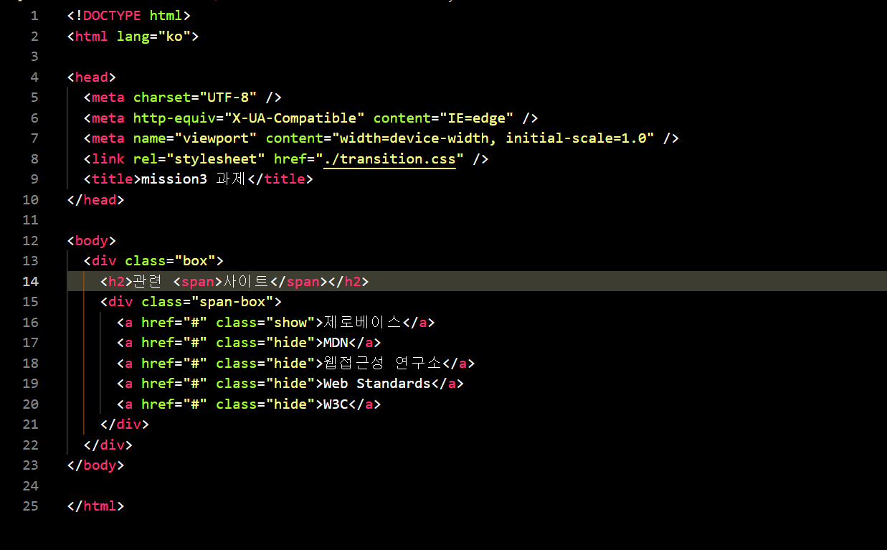
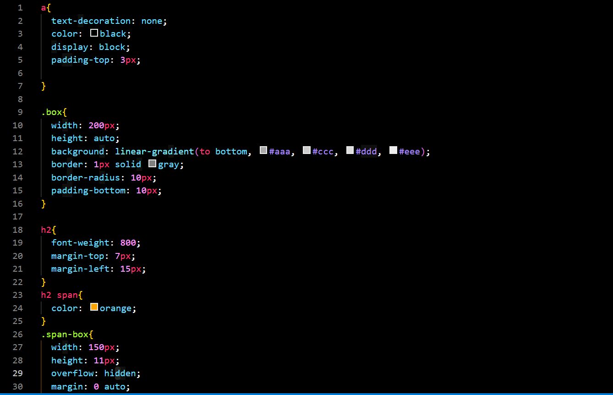
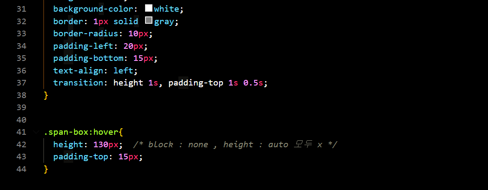

# mission-02 설명

## html 코드

전체 요소를 담을 클래스인 box를 선언.   그 안에 제목을 표시해줄 h2 태그와 애니메이션을 해줄 텍스트가 담긴 span-box 클래스를 선언하고 그 안에 각 텍스트 마다 a 태그를 지정.

## css 코드

텍스트 들이 담긴 span-box 클래스의 높이를 지정 해주고 overflow:hidden을 줘서 span-box 클래스를 벗어난 요소들이 보이지 않게 만들어줌.  
그리고 span-box에 hover 시 높이를 늘려줘서 안보였던 요소가 보일수 있도록 해주고 글자 위치도 바뀔수 있도록 padding-top을 지정해줌. 
마지막으로 transition의 property 를 이용해 height는 1s 간격으로 애니메이션 되도록 만들고 padding-top은 hover 시 0.5s 후 1s 간격으로 애니메이션 되도록 css 코드를 작성함.