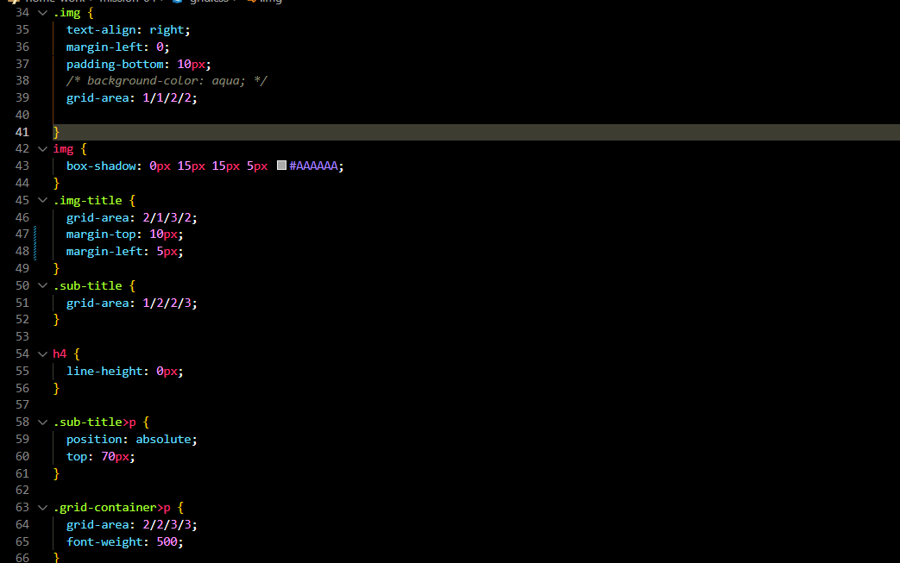

# mission-4 과제

## html 코드

전체 태그를 담을 클래스인 container 안에 header를 나타낼 headere 클래스와 그 밑에 grid 로 요소를 배치할 grid-container 클래스를 선언함. grid-container 안에는 img 를 나타낼 figure 태그와 figure 태그 자식요소로 figcaption 태그를 사용해 이미지를 설명하는 텍스트를 배치했다. 그리고 밖으로 빠져나와서 이미지 옆 제목, 날짜를 나타낼 sub-title 클래스와 제목에 맞는 내용을 나타내는 p 태그를 마크업 하였다.

## css 코드

 전체 요소들의 클래스의 크기를 지정한 후 , header 클래스에 relative 속성값을 줘서 position: absolute 의 기준점으로 만들고 flex를 사용해 가로 배치를 해줌. 그리고 header 밑에 선을 그어주기 위해서 가상요소 after를 사용해 선의 길이를 width를 이용해 조정해주고 absolute 속성값을 주고 top을 통해 위치를 지정해줌. 
마지막으로 .grid-container 클래스 요소들을 grid 배치를 이용하기 위해서 부모요소인 해당 클래스에 display:grid 를 선언하고 각 행과 열의 크기 4개의 섹션으로 나눠서 정해줌.

     

img 클래스의 이미지는 왼쪽 상단에 배치하기 위해서 grid-area : 1/1/2/2 선언.
그 이미지 밑에 제목을 나타내는 img-title 클래스는 왼쪽 하단에 배치.
오른쪽 상단에는 이미지 옆 제목과 날짜를 나타내는 sub-title 클래스를 배치하고 해당 클래스 내부에서 날짜를 나타내는 p 태그는 제목과의 줄 간격을 맞춰주기 위해서 absolute 이용해 배치함. 마지막으로 제목에 대한 내용을 나타내는 .grid-container>p 태그는 우측 하단에 배치함.

## 결과화면

