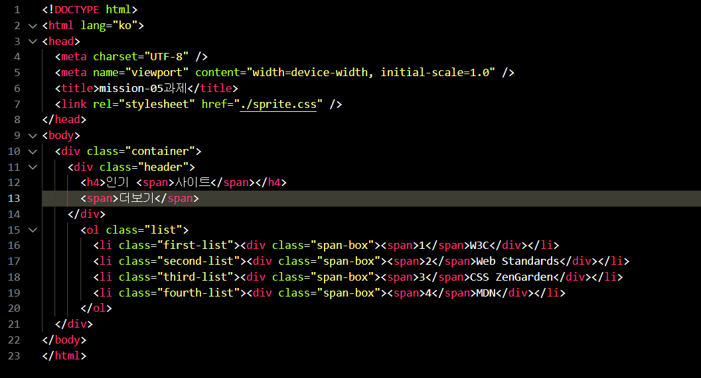
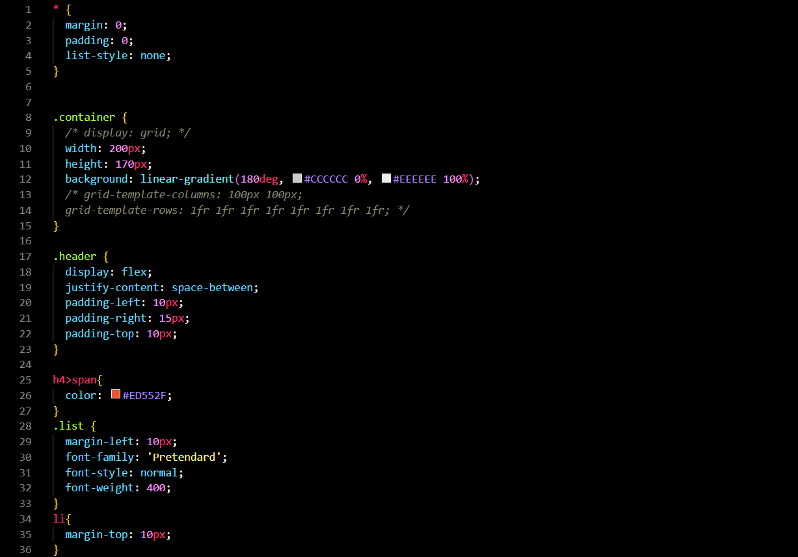
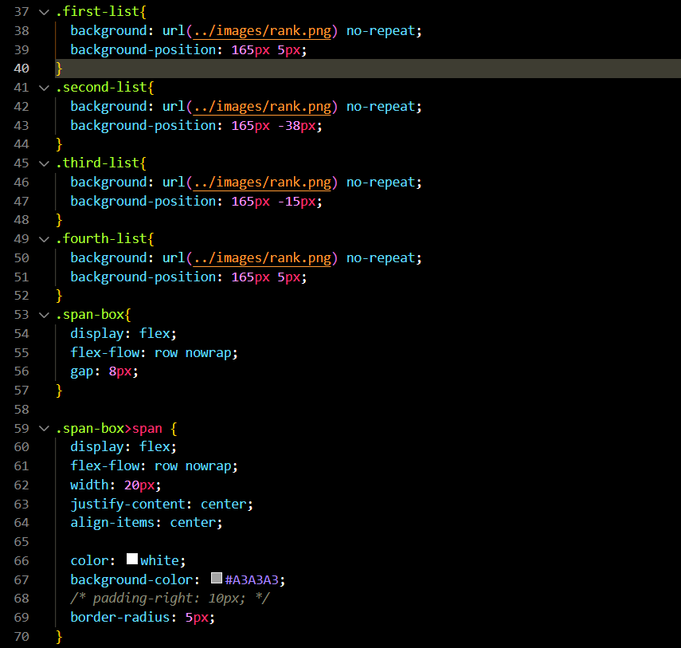
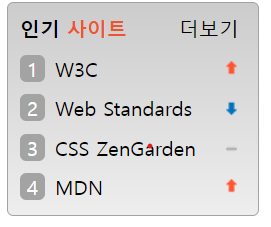

# misson-5 과제
## html 코드

전체 요소를 담을 클래스 container 안 header 클래스를 선언하고 해당 클래스 안에 상단의 텍스트들을 입력해 줌. 다음 형제 클래스인 list 에는 각각의 li 순서대로 image sprite 기법을 사용하기 위해서 클래스명을 선언하였다. 그리고 그 안에 span-box 클래스를 만들고 스타일을 지정해줄 텍스트를 span으로 묶어줬다.

## css 코드

(사진에는 안보이지만 container 클래스에 마진과 border 값 추가.)   
header 클래스를 flex 를 선언 후 space-between 으로 정렬한 뒤 각각 패딩 왼, 오른쪽을 줘서 글자 위치를 잡아줌. 

다음으로 li 태그 순서대로 선언한 클래스 안에 background-image 속성에서 sprite 이미지를 주고 각 li 태그 마다 사용할 그림들이 나타날 수 있게 position을 잡아주었다. 그리고 li 태그 안 텍스트들을 묶어준 span-box 클래스에 flex 속성을 줘서 글자들을 가로로 정렬함. 마지막으로 span-box 클래스 안 span 태그를 직접 숫자를 입력하고 배경색과, radius를 주며 디자인 하였고 , 내부 글자를 수평 가운데로 정렬해주기 위해서 flex의 justify-content 속성을 이용해 수평 가운데로 글자를 정렬해 주었다.
     

## 결과물
